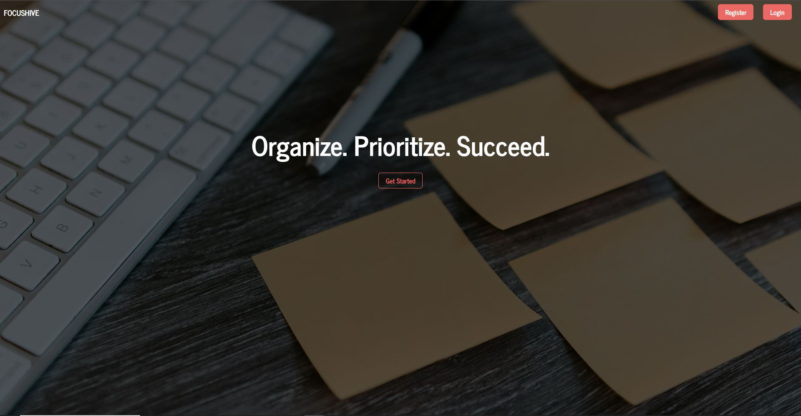
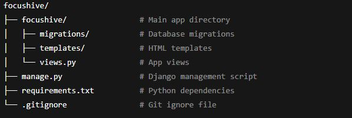

# 🐝 FocusHive

A minimalist Django web app designed to help users track and manage their daily tasks with a focus on simplicity and efficiency.

[🌐 Live Demo]([insert link to render hosted project here])

---

## 📸 Screenshot

---

## 🎯 Features

- User authentication with login and registration
- Task creation, editing, and deletion
- Task priortization and categorization
- Clean and responsive design

---

## 🛠️ Tech Stack

- **Django** - Backend framework
- **PostgreSQL (AWS RDS)** – Relational database
- **Amazon S3** - Static & media file storage
- **HTML5 & CSS3** - Frontend structure and styling
- **Bootstrap5** - Responsive design framework
- **AWS** - Cloud hosting infrastructure

---

## 🚀 Getting Started

To run this app locally:

### 1. Clone the repository

git clone https://github.com/zandernh/focushive.git
cd focushive

### 2. Set up a viritual enviornment

python -m venv venv
source venv/bin/activate # On Windows, use `venv\Scripts\activate`

### 3. Install dependencies

pip install -r requirements.txt

### 4. Apply database migrations

python manage.py migrate

### 5. Create a superuser to access the admin panel

python manage.py createsuperuser

### 6. Run the development server

python manage.py runserver

### 7. Access the app at:

http://127.0.0.1:8000

---

## 🧠 How It Works

- User can register and log in to manage their tasks
- Tasks can be created, edited, and deleted
- The admin panel allows for managing users and tasks

## 📂 File Structure

---

## 📦 Deployment

The app is deployed using Render (free tier) for hosting

- **Database**: AWS RDS (PostgreSQL)
- **Static & Media Files**: AWS S3
- **Environment Variables**: Managed securely on Render

---

## 📄 License

This project is open-source and free to use under the MIT Licence

---

## 🙋‍♂️ Author

Built by Zander Harding
